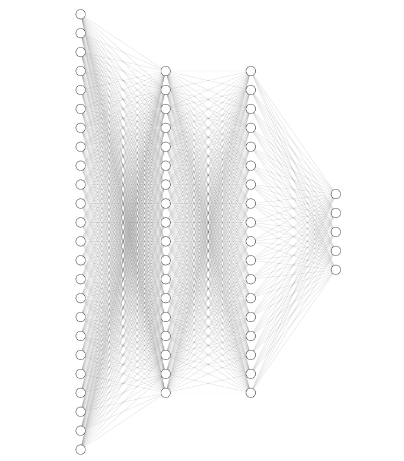

# BP神经网络

## 简介
本文主要通过在MNIST数据集上使用全连接神经网络对比有无归一化、有无Dropout以及有无Batch Normalization进行训练，可视化分析常用的深度网络训练技巧的原因及效果。

## 网络结构
网络结构类似下图，输入层定为784（输入图片特征数），隐藏层1有512个神经元（tanh激活），隐藏层2有512个神经元（tanh激活），输出层有10个神经元（softmax激活，得到10个类别的概率分布）。

## 训练Pipeline
### 输入数据
将输入的一个batch的数据的x处理为[b, 784]，y通过onehot编码处理为[b, 10]，
### 前向传播
前向计算，得到各层的输入和输出。
### 反向传播
按照BP规则，计算各个参数的梯度。
### 参数优化
按照Adam算法，对参数进行更新。

## 源码
由于模块较多，这里直接给出最为核心的model源码，其他模块可以在文末的Github找到。

## 训练效果
### 对比有无归一化
**主要用途**

调整输入层数值尺度，以便统一使用梯度下降优化时统一各层参数优化的学习率。（不然输入层需要使用较低学习率）

**使用效果**

收敛更快 即损失下降更快。

**训练集**

**验证集**

**测试集**

### 对比有无Dropout
**主要用途**

随机关闭神经元以减少神经元之间的相关度，从而逼迫神经网络进行更加复杂的学习，有效抑制过拟合。

**使用效果**

训练收敛变慢，测试效果变好。

**训练集**

**验证集**

**测试集**

### 对比有无Batch Normalization
**主要用途**

将各层网络的输入统一为标准正态分布，加快网络的学习，有效解决训练的相关问题。

**使用效果**

训练加速。

**训练集**

**验证集**

**测试集**

## 补充说明
本案例均使用Numpy手写神经网络的训练，如有疏漏之处欢迎之处。源码开源于Github，欢迎star和fork。